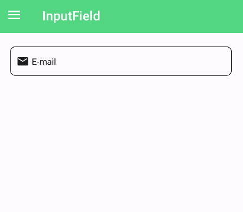
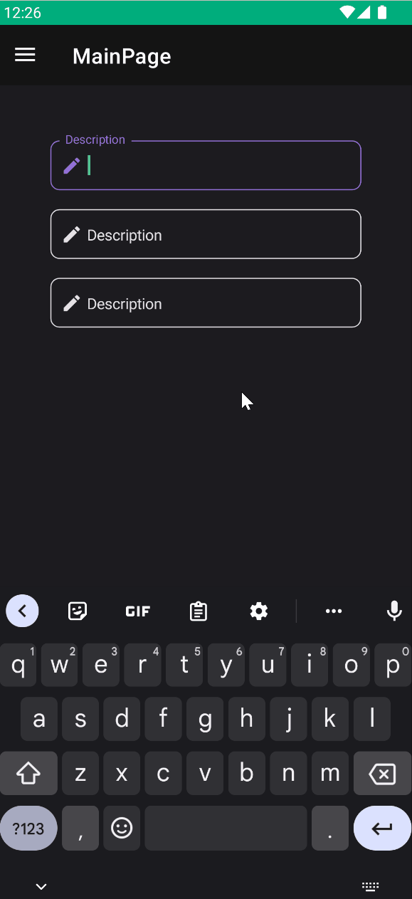
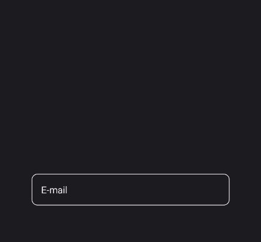
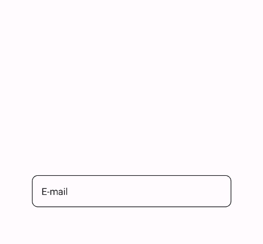
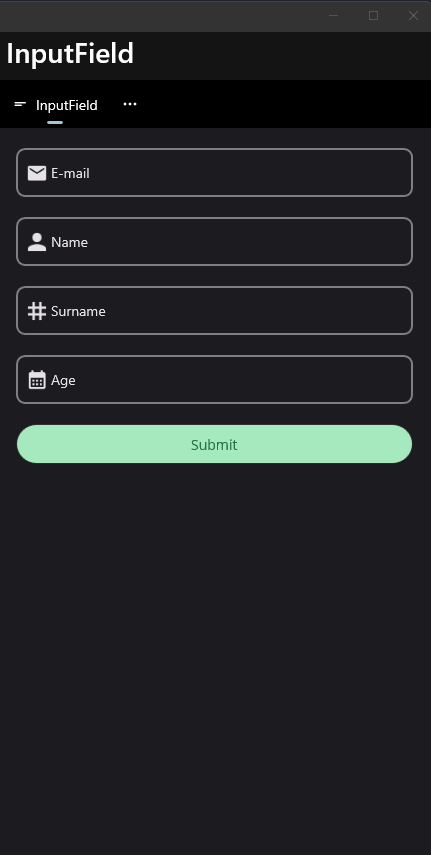

# TextField
Text fields let users enter and edit text. It is an abstraction on MAUI Level for material inputs.

## Usage

TextField is included in the `UraniumUI.Material.Controls` namespace. You should add it to your XAML like this:

```xml
xmlns:material="http://schemas.enisn-projects.io/dotnet/maui/uraniumui/material"
```

Then you can use it like this:

```xml
<material:TextField Title="Name" />
<material:TextField Title="Surname" />
<material:TextField Title="Age" Keyboard="Numeric" />
```

| Light | Dark |
| --- | --- |
|  |  |


## Icon
TextFields support setting an icon on the left side of the control. You can set the icon by setting the `Icon` property. The icon can be any `ImageSource` object. FontImageSource is recommended as Icon since its color can be changed when focused.

```xml
 <material:TextField
    Title="E-mail"
    Icon="{FontImageSource FontFamily=MaterialRegular, Glyph={x:Static m:MaterialRegular.Email}}"/>
```

| Light | Dark |
| --- | --- |
|  |  |

## AccentColor
The color that is used to fill border and icon of control when it's focused. You can change it by setting `AccentColor` property of the control.

```xml
 <material:TextField
    Title="Description"
    Icon="{FontImageSource FontFamily=MaterialRegular, Glyph={x:Static m:MaterialRegular.Edit}}"
    AccentColor="DeepSkyBlue"/>
```




## AllowClear
TextFields support clearing the text by setting the `AllowClear` property to `true`. Default value is `false`.

```xml
 <material:TextField
    Title="E-mail"
    AllowClear="True"/>
```

|Dark| Light|
| --- | --- |
|  |  |

## Attachments
Attachments are additional controls that can be placed inside the control. They are placed on the end of the control (right-side on LTR). You can add attachments by using `Attachments` property. It is a collection of `View` objects.

```xml
<material:TextField Title="Message">
    <material:TextField.Attachments>
        <Button Text="Submit" />
    </material:TextField.Attachments>
</material:TextField>
```


### Password Show/Hide
You can use pre-defined `TextFieldPasswordShowHideAttachment` to create a password show/hide button. It is a button that toggles the `IsPassword` property of the control.

```xml
<material:TextField Title="Password" IsPassword="True">
    <material:TextField.Attachments>
        <material:TextFieldPasswordShowHideAttachment />
    </material:TextField.Attachments>
</material:TextField>
```


## Validation

Validation logic is exactly same with [InputKit Validations](https://enisn-projects.io/docs/en/inputkit/latest/components/controls/FormView#validations).

You can define validations by using `Validations` property. It is a collection of `Validation` objects. Each `Validation` object has a `Message` property that is a string and will be displayed when the validation fails.

UraniumUI provides an easier way than InputKit and allows defining validations without using `Validations` property. Validations can be placed inside `TextField` tags.

```xml
<material:TextField Title="E-mail" Icon="{FontImageSource FontFamily=MaterialRegular, Glyph={x:Static m:MaterialRegular.Email}}">
    <validation:RequiredValidation />
    <validation:RegexValidation Pattern="{x:Static input:AdvancedEntry.REGEX_EMAIL}" Message="Invalid email address" />
</material:TextField>
```

### FormView Compatibility
TextField is fully compatible with [FormView](https://enisn-projects.io/docs/en/inputkit/latest/components/controls/FormView). You can use it inside a FormView and it will work as expected.

```xml
 <input:FormView Spacing="20">

    <material:TextField Title="E-mail" Icon="{FontImageSource FontFamily=MaterialRegular, Glyph={x:Static m:MaterialRegular.Email}}">
        <validation:RequiredValidation />
        <validation:RegexValidation Pattern="{x:Static input:AdvancedEntry.REGEX_EMAIL}" Message="Invalid email address" />
    </material:TextField>

    <material:TextField Title="Name" Icon="{FontImageSource FontFamily=MaterialRegular, Glyph={x:Static m:MaterialRegular.Person}}">
        <validation:LettersOnlyValidation AllowSpaces="True" />
        <validation:RequiredValidation />
        <validation:MinLengthValidation MinLength="5" />
    </material:TextField>

    <material:TextField Title="Surname" Icon="{FontImageSource FontFamily=MaterialRegular, Glyph={x:Static m:MaterialRegular.Tag}}" >
        <material:TextField.Validations>
            <validation:RequiredValidation />
            <validation:LettersOnlyValidation AllowSpaces="True" />
            <validation:MinLengthValidation MinLength="5" />
        </material:TextField.Validations>
    </material:TextField>

    <material:TextField Title="Age" Keyboard="Numeric" Icon="{FontImageSource FontFamily=MaterialRegular, Glyph={x:Static m:MaterialRegular.Calendar_month}}">
        <material:TextField.Validations>
            <validation:MinValueValidation MinValue="18" />
            <validation:DigitsOnlyValidation />
        </material:TextField.Validations>
    </material:TextField>

    <Button StyleClass="FilledButton"
            Text="Submit"
            input:FormView.IsSubmitButton="True"/>

</input:FormView>
```

| Light | Dark |
| --- | --- |
|  |  |


## Styling
TextField has the following style classes that can be used to style the control:

```xml
<Style TargetType="Label" Class="InputField.Title">
    <Setter Property="FontAttributes" Value="Bold" />
    <!--...-->
</Style>

<Style TargetType="Border" Class="InputField.Border">
    <Setter Property="MaximumHeightRequest" Value="80" />
    <!--...-->
</Style>

<Style TargetType="Image" Class="InputField.Icon">
    <Setter Property="HeightRequest" Value="10" />
    <Setter Property="WidthRequest" Value="10" />
    <!--...-->
</Style>

<Style TargetType="HorizontalStackLayout" Class="InputField.Attachments">
    <Setter Property="Spacing" Value="8" />
    <!--...-->
</Style>
<Style TargetType="Path" Class="InputField.ValidationIcon">
    <Setter Property="Fill" Value="MediumVioletRed" />
    <Setter Property="Data" Value="M7 11V1H8V11H7ZM8 13V14.01H7V13H8Z" />
    <!--...-->
</Style>

<Style TargetType="Label" Class="InputField.ValidationLabel">
    <Setter Property="TextColor" Value="MediumVioletRed" />
    <!--...-->
</Style>

<Style TargetType="Path" Class="TextField.ClearIcon">
    <Setter Property="Fill" Value="LightGray" />
    <Setter Property="Data" Value="M1.5 1.5L13.5 13.5M1.5 13.5L13.5 1.5" />
    <!--...-->
</Style>
```